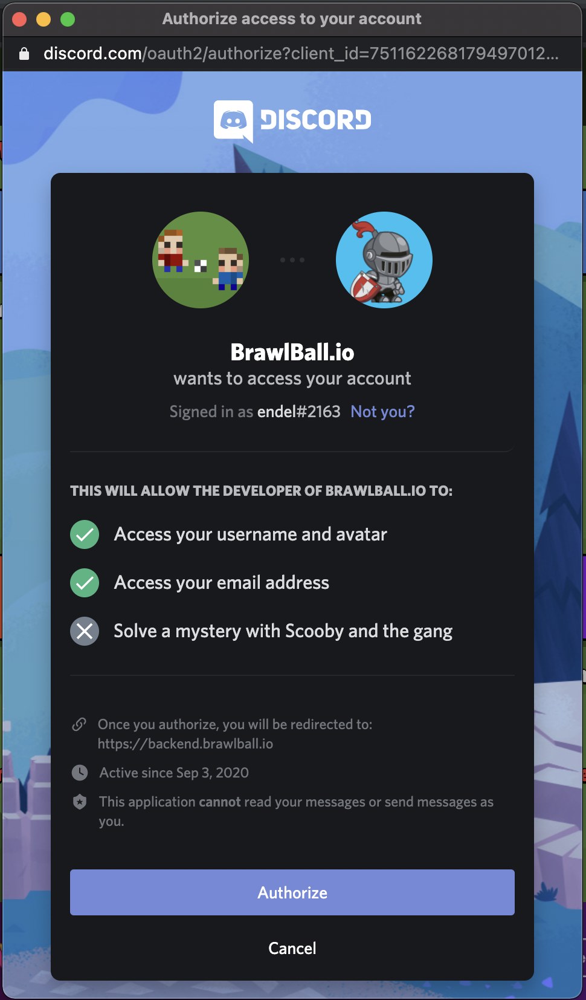
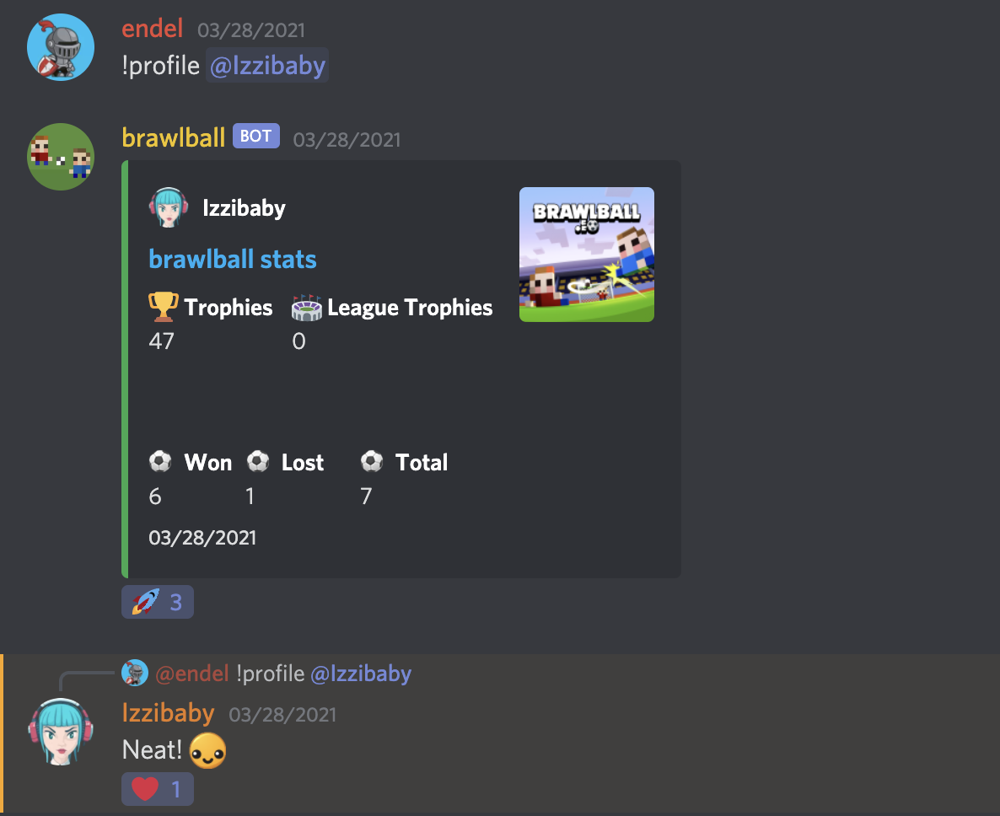
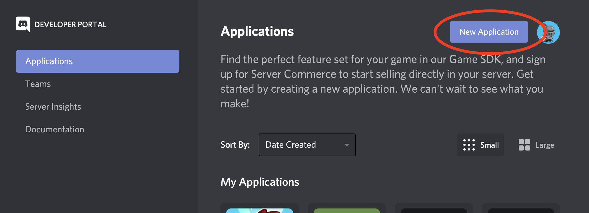
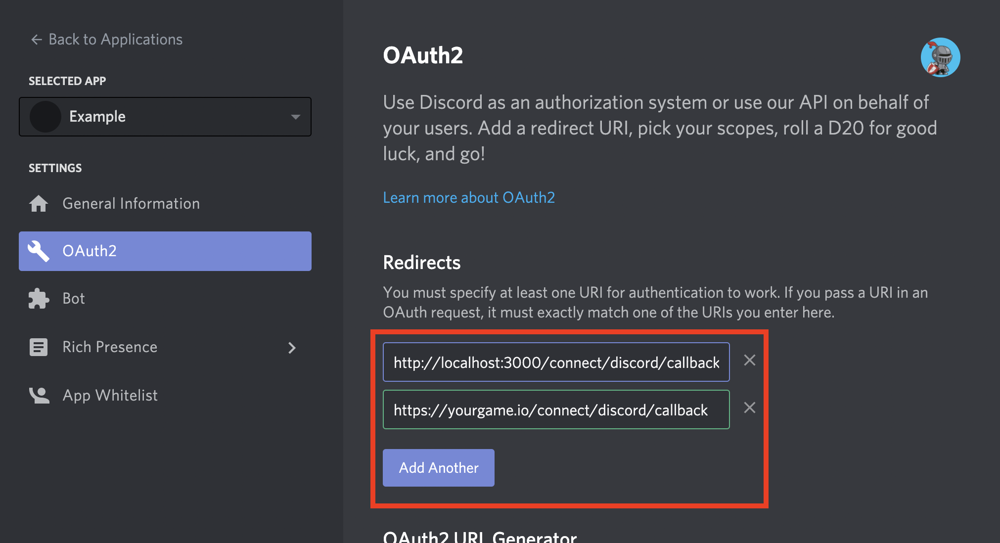
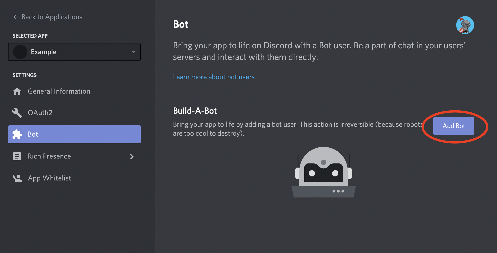
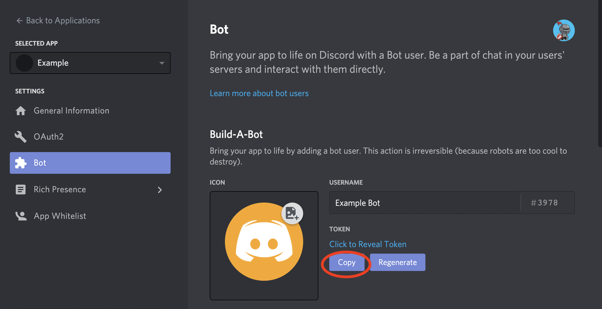
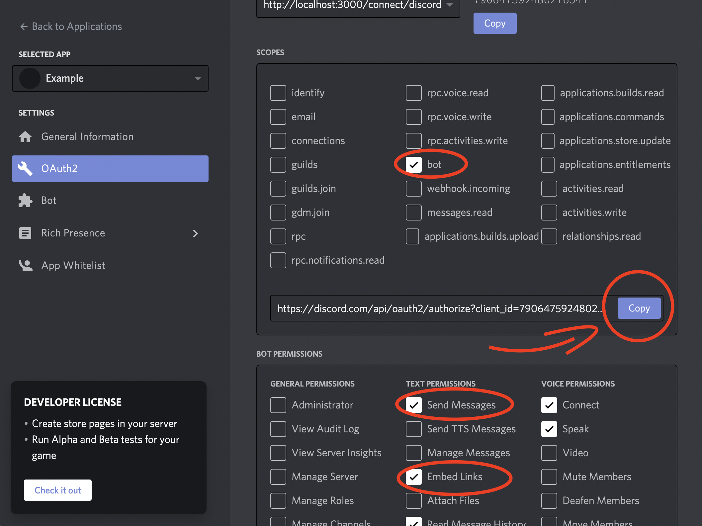
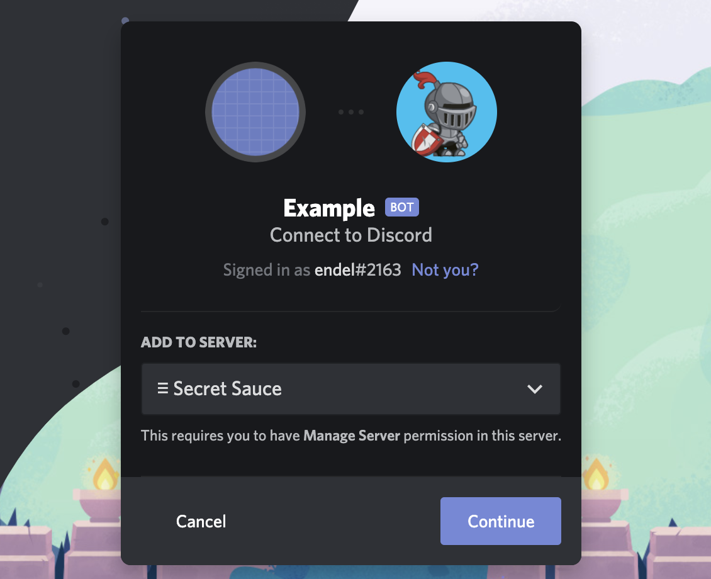

# Discord Web Game Toolkit 

The code on this repository is a Node.js application that you can either copy the files over to your existing Node.js application, or build your own stuff on top of it. You should deploy this code on your own server in order to have it working for your game.




What's included here?

- Discord OAuth Integration
- Discord Bot with a `!profile` command to output the player's profile.
- Express routes to authenticate with Discord
- A `User` model with default properties, and a database setup. Add more models as you need.

Node modules in use:
- [MikroORM](https://www.npmjs.com/package/@mikro-orm/core) + [MongoDB](https://www.npmjs.com/package/mongodb) for database access.
- [Grant](https://www.npmjs.com/package/grant) for OAuth integration. Only Discord is being used, but you can easily use more providers such as Google, Twitter, etc.
- [Express](https://www.npmjs.com/package/express) for binding Grant routes, and custom login.
- [JsonWebToken](https://www.npmjs.com/package/jsonwebtoken) for encrypting and exposing a token containing the `discord_id` for the client-side.
- [Discord.js](https://www.npmjs.com/package/discord.js) for Discord Bot integration.

# Setup Instructions

## Discord Authentication

Go to [https://discord.com/developers/applications](https://discord.com/developers/applications) and click on "New Application".



After having your application created, you need to copy both your **CLIENT ID** and **CLIENT SECRET**, and paste it into the `.env` file.


In the `.env` file, these values will look like this:

```
DISCORD_CLIENT_ID=790647592480276541
DISCORD_CLIENT_SECRET=20fgvLavtsc87sMXYdV6ETeSI92LwP8m
```

Add OAuth Redirect to all possible deployments of your game. You should have at least two entries here:



- `http://localhost:3000/connect/discord/callback`: For testing locally.
- `http://yourgame.io/connect/discord/callback`: For the live game (replace `yourgame.io` to where your game is deployed remotely!)

## Discord bot

Now let's create the bot for your Discord application:



Copy the "token" of your bot, and paste it into the `.env` file as well.



In the `.env` file, the token will look like this:

```
DISCORD_BOT_TOKEN=NzkwNjQ3NTkyNDgwMjc2NTQx.X-Dp8w.hBQGt-ioJKvaIgdWp0NPFRPIa-w
```

## Adding the bot to your server

The last step is to add the bot into your server. 

1. Select "OAuth" in the sidebar.
2. In the "OAuth2 URL Generator", under "scopes" - select "bot".
3. Under "Bot permissions", select "Send Messages", and "Embed links". You may select more options if you are going to implement more features on your own!



Now, click on "Copy" in the authorization URL, and open it in your browser. You will be asked to select the server the bot is going to join:



You're done! Have fun making custom bot actions for your game!

# Community

<a href="https://discord.gg/dqTw2cKrAe"></a>

# License

Copyright © Endel Dreyer. See [LICENSE.md](LICENSE.md) for more details.