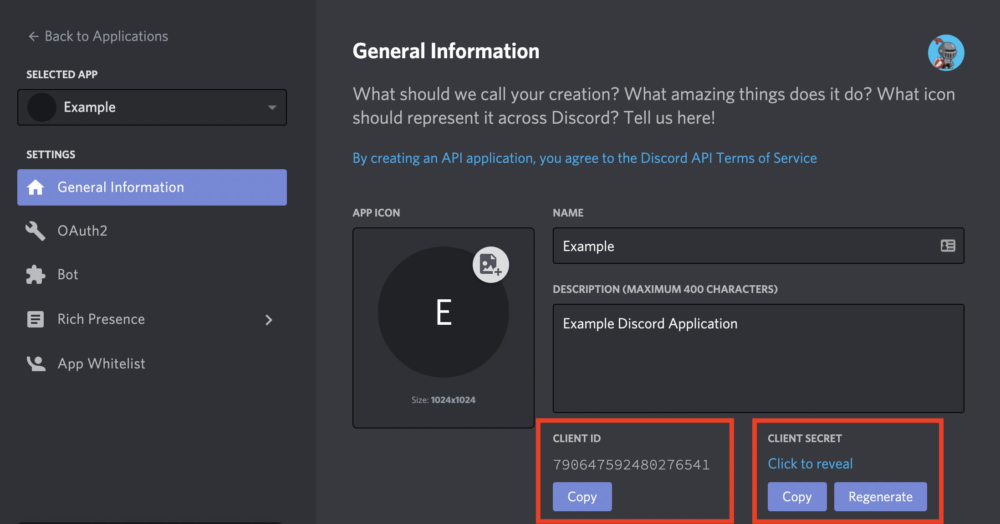

# Discord Web Game Toolkit


What's included here?

- Discord OAuth Integration
- Discord Bot with a `!profile` command to output the player's profile.
- Express routes to authenticate with Discord
- A `User` model with default properties, and a database setup. Add more models as you need.

Node modules in use:
- [MikroORM](https://www.npmjs.com/package/@mikro-orm/core) + [MongoDB](https://www.npmjs.com/package/mongodb) for database access.
- [Grant](https://www.npmjs.com/package/grant) for OAuth integration. Only Discord is being used, but you can easily use more providers such as Google, Twitter, etc.
- [Express](https://www.npmjs.com/package/express) for binding Grant routes, and custom login.
- [JsonWebToken](https://www.npmjs.com/package/jsonwebtoken) for encrypting and exposing a token containing the `discord_id` for the client-side.
- [Discord.js](https://www.npmjs.com/package/discord.js) for Discord Bot integration.

# Setup Instructions

## Discord Authentication

Go to [https://discord.com/developers/applications](https://discord.com/developers/applications) and click on "New Application".


After having your application created, you need to copy both your **CLIENT ID** and **CLIENT SECRET**, and paste it into the `.env` file.



In the `.env` file, these values will look like this:

```
DISCORD_CLIENT_ID=790647592480276541
DISCORD_CLIENT_SECRET=20fgvLavtsc87sMXYdV6ETeSI92LwP8m
```

> TODO: explain the session store + redis.

> TODO: explain grant

## Discord bot

Now let's create the bot for your Discord application:


Copy the "token" of your bot, and paste it into the `.env` file as well.


In the `.env` file, the token will look like this:

```
DISCORD_BOT_TOKEN=NzkwNjQ3NTkyNDgwMjc2NTQx.X-Dp8w.hBQGt-ioJKvaIgdWp0NPFRPIa-w
```


# License

Copyright © Endel Dreyer. See [LICENSE.md](LICENSE.md) for more details.